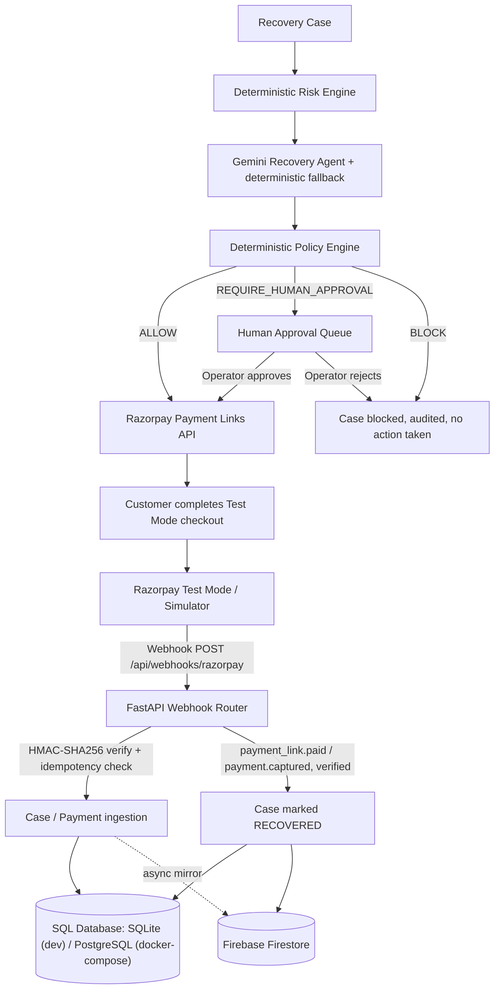

# RazorRecover AI

An AI-assisted revenue recovery system for failed Razorpay payments: it scores payment-failure risk deterministically, uses Gemini to diagnose the likely cause and recommend a recovery action, validates every recommendation against a hard-coded policy engine, routes high-risk or low-confidence cases to a human operator, and — once cleared — creates a real Razorpay Test Mode Payment Link whose success is confirmed only via a signed webhook.

**Razorpay AI Buildathon 2026 — Track 03: AI Revenue Recovery**

---

> **Razorpay Test Mode Notice.** This project runs entirely against Razorpay **Test Mode**. No real money moves. When Razorpay Test Mode credentials are not configured, the system falls back to a clearly labeled `LOCAL_SIMULATION` mode. See the "Synthetic Evaluation" and "Current Scope & Limitations" sections below for exactly how these are separated.

---

## Overview

Failed recurring/one-time payments are a normal part of running a payments business — cards expire, banks time out, UPI daily limits get hit, customers abandon checkout. The naive response (retry the same card on a fixed schedule) is exactly what Razorpay does not allow: gateways require fresh customer authentication for most retries, and blind retries risk issuer penalties and chargebacks.

RazorRecover AI treats each failed payment as a **case** that moves through a fixed pipeline: a deterministic risk score, an AI diagnosis, a deterministic policy check, optional human approval, and — only if cleared — a real Razorpay Payment Link, verified through a signed webhook before anything is marked recovered.

## Problem

Recurring and one-time digital payments fail for many mundane reasons: insufficient balance, an expired card on file, a timed-out gateway call, an abandoned 3DS/OTP challenge, or a genuinely dead card. Two things make this harder than "just retry it":

- **Razorpay does not support arbitrary headless retries.** Most retry paths require fresh customer-initiated authentication, so a merchant's own automation can't silently re-charge a saved card.
- **Not all failures are equal.** A transient bank timeout and a stolen card look similar in raw logs but need opposite treatment — one deserves a quick retry, the other should never be retried again.

This project does not claim to know real revenue-loss figures for any merchant. The contribution here is the recovery **workflow and its safety architecture**, not a revenue-loss estimate.

## Solution

```
Payment fails (Razorpay Test Mode or webhook ingest)
        │
        ▼
Case created — state: AT_RISK
        │
        ▼
Deterministic Risk Engine  (risk score, recoverability score, expected recovery)
        │
        ▼
Gemini diagnosis + recommendation  (deterministic fallback if no API key / call fails)
        │
        ▼
Deterministic Policy Engine  (ALLOW / BLOCK / REQUIRE_HUMAN_APPROVAL)
        │
   ┌────┴─────┐
   ▼          ▼
BLOCKED   Human approval queue ──approve──▶ APPROVED
   │                                            │
   └──────────────  (no action taken)           ▼
                                     Razorpay Payment Link created
                                     (Test Mode, or LOCAL_SIMULATION
                                      if no credentials configured)
                                            │
                                            ▼
                                  Customer pays in Test Checkout
                                            │
                                            ▼
                          Razorpay webhook → HMAC-SHA256 verified
                                            │
                                            ▼
                              Case marked RECOVERED, Firestore
                              + audit trail updated
```

Every step above corresponds to real code in this repository (`agent/`, `apps/api/routers/`, `integrations/razorpay/`) — nothing here describes a planned-but-unbuilt step.

## Why This Approach

An LLM is well suited to interpreting messy failure text and customer context and turning it into a specific recommendation. It is not well suited to being the thing that decides whether a money-adjacent action is allowed to fire — LLM output is probabilistic, and payment actions need to be deterministic, auditable, and bounded. So the design keeps a hard line between "AI reasons" and "code decides": Gemini (or its deterministic fallback) only ever produces a recommendation object; a separate, non-LLM policy engine is the only thing that can authorize a Razorpay-facing call.

## Key Features

| Feature | Status | Where it lives |
|---|---|---|
| Deterministic risk & recoverability scoring | Implemented | `agent/core/risk_engine.py` |
| Gemini-based diagnosis with deterministic fallback | Implemented | `agent/core/recovery_agent.py` |
| Controlled tool interfaces (agent can't touch the DB/API directly) | Implemented | `agent/tools/registry.py` |
| Deterministic policy engine (12 ordered rules) | Implemented | `agent/policies/policy_engine.py` |
| Human approval / rejection queue | Implemented | `apps/api/routers/cases.py` (`/approve`, `/reject`) |
| Razorpay Payment Link creation | Implemented, real API call in Test Mode | `integrations/razorpay/payment_links.py` |
| Local simulation fallback when no Razorpay credentials | Implemented, explicitly labeled `LOCAL_SIMULATION` | `integrations/razorpay/payment_links.py`, `client.py` |
| Webhook HMAC-SHA256 signature verification | Implemented | `integrations/razorpay/webhooks.py`, `apps/api/routers/webhooks.py` |
| Webhook idempotency (DB-backed) | Implemented | `database/schema/models.py` (`WebhookEvent`), `webhooks.py` |
| Append-only audit log per case | Implemented | `database/schema/models.py`, written from every router |
| Firebase Firestore mirroring of cases/decisions/audit events | Implemented | `database/firestore_sync.py`, `firestore_client.py` |
| Synthetic 500-case evaluation benchmark | Implemented, deterministic (seeded RNG) | `agent/evaluation/evaluator.py`, `simulator/scenarios/definitions.py` |
| Dashboard metrics (live cases + evaluation runs) | Implemented | `apps/api/routers/dashboard.py`, `apps/web` |
| Production deployment (Render) | Deployed, Test Mode only | see "Deployment" below |

## Architecture



| Component | Responsibility | Input | Output |
|---|---|---|---|
| FastAPI backend (`apps/api`) | HTTP API, routing, webhook ingestion | HTTP requests, Razorpay webhooks | JSON responses, DB writes |
| Risk Engine (`agent/core/risk_engine.py`) | Pure-function risk/recoverability scoring | amount, failure reason, attempt count, customer history | risk score, risk level, recoverability %, expected recovery |
| Recovery Agent (`agent/core/recovery_agent.py`) | Diagnosis + recommendation | case, payment, customer context (via tool registry) | diagnosis, recommended action, confidence |
| Tool Registry (`agent/tools/registry.py`) | Controlled data access for the agent | payment/customer IDs | sanitized dictionaries only |
| Policy Engine (`agent/policies/policy_engine.py`) | Final say on whether an action executes | recommended action, amount, confidence, risk, attempts | `ALLOW` / `BLOCK` / `REQUIRE_HUMAN_APPROVAL` |
| Razorpay integration (`integrations/razorpay/`) | Payment Link creation, connection test, webhook verification | case amount + contact, raw webhook body | Payment Link URL, verified event |
| Database (`database/`) | System of record | ORM writes from every router | cases, payments, decisions, audit log |
| Firestore sync (`database/firestore_sync.py`) | Mirrors key collections for the dashboard | case/decision/audit dicts | Firestore documents |
| Evaluation Engine (`agent/evaluation/evaluator.py`) | Synthetic benchmark vs. naive baseline | 12 scenario definitions | recovery rate, blocked-unsafe count, escalations |

## End-to-End Recovery Flow

1. A payment fails in Razorpay Test Mode (or a synthetic failure is seeded via the simulator), producing a `payment.failed` webhook or a seeded record.
2. A `RecoveryCase` is created in state `AT_RISK`, with risk/recoverability scores computed by `RevenueRiskEngine`.
3. `POST /api/recovery-cases/{id}/analyze` runs the Recovery Agent, which gathers context via the tool registry and produces a diagnosis + recommended action (Gemini, or the deterministic fallback if no API key is set or the call fails).
4. The `DeterministicPolicyEngine` evaluates the recommendation against 12 ordered rules.
5. `ALLOW` → the case moves to `APPROVED` automatically.
6. `REQUIRE_HUMAN_APPROVAL` → the case moves to `PENDING_APPROVAL` and waits for an operator.
7. `BLOCK` → the case moves to `BLOCKED`; no further action is taken.
8. Once `APPROVED`, `POST /api/recovery-cases/{id}/execute` creates a Razorpay Payment Link (Test Mode, or `LOCAL_SIMULATION` if no credentials are configured).
9. The customer completes payment on Razorpay's real Test Mode checkout page.
10. Razorpay sends a `payment_link.paid` / `payment.captured` webhook, which is signature-verified and checked for idempotency.
11. The case is updated to `RECOVERED`, `actual_recovery` is set, and the change is mirrored to Firestore.
12. Every transition above writes an `AuditLog` row with the previous state, new state, actor, and reason.

## AI Agent Design

**Gemini recommends. Deterministic policies control execution.**

`RecoveryAgent.analyze_case()` (`agent/core/recovery_agent.py`):

1. Pulls payment details, customer history, a deterministic risk score, a deterministic recoverability score, and a rule-based failure classification — all via the narrow `AgentToolRegistry` interface, never raw DB access.
2. If `GEMINI_API_KEY` is configured, calls `gemini-flash-latest` (model configurable via `GEMINI_MODEL`) with a system prompt (`agent/prompts/recovery_prompts.py`) and a structured, JSON-only response format. The model receives the case's numeric context (amount, attempt count, failure reason/code, customer success rate, LTV, risk/recoverability scores) and returns a diagnosis, a recommended action from a fixed action catalog, a confidence score, and whether it thinks human approval is warranted.
3. If no API key is set, or the Gemini call raises an exception, the agent falls back to `_analyze_with_deterministic_model()` — a rule-based decision tree keyed on failure-reason text (insufficient funds → delayed retry, network timeout → immediate retry, expired card / failed 3DS → payment link, repeated failures → escalate/stop, hard declines → stop). This keeps the pipeline from ever blocking on an external API being unavailable, and it is exercised by `tests/unit/test_tools.py` and by the evaluation engine.
4. Either way, the output is a `recommended_action` plus a `confidence` score — never a directly executed action.

**What Gemini cannot do:** it has no tool that calls Razorpay, no tool that writes financial state, and no path to bypass the policy engine. If the policy engine blocks the recommendation, no Razorpay call is made regardless of what the model returned. If it requires human approval, the case sits in `PENDING_APPROVAL` until an operator calls `/approve` or `/reject`.

## Policy Guardrails

`DeterministicPolicyEngine.evaluate()` runs 12 ordered, non-LLM rules against every recommendation before anything reaches Razorpay. Defaults (overridable via a `SystemSettings` row):

| Guardrail | Purpose | Behaviour |
|---|---|---|
| Action whitelist | Only a fixed set of action types is ever accepted | `BLOCK` unrecognized actions |
| Customer opt-out | Respect customers who opted out of contact | `BLOCK` notifications/payment links |
| Recovery window (default 14 days) | Don't chase payments indefinitely | `BLOCK` once the window has elapsed |
| Max retry attempts (default 3) | Prevent repeated debit attempts | `BLOCK` further retries once exceeded |
| Retry cooldown (default 60 min) | Prevent hammering the issuer | `BLOCK` an immediate retry inside the cooldown |
| Max contact attempts (default 2) | Prevent notification spam | `BLOCK` further customer outreach |
| Max automatic amount (default ₹25,000) | Keep autonomous execution bounded | `REQUIRE_HUMAN_APPROVAL` above the ceiling |
| Minimum AI confidence (default 0.70) | Don't auto-execute low-confidence recommendations | `REQUIRE_HUMAN_APPROVAL` below threshold |
| Critical risk level | Extra scrutiny for the riskiest cases | `REQUIRE_HUMAN_APPROVAL` |
| Explicit `HUMAN_ESCALATION` recommendation | Respect the agent's own escalation call | `REQUIRE_HUMAN_APPROVAL` |
| Explicit `STOP_RECOVERY` | Always safe to confirm a stop | `ALLOW` (no money movement) |
| All checks passed | — | `ALLOW` |

These thresholds are configuration values, not prompt instructions — a hallucinating LLM response cannot change them. Every policy decision (with its `rule_id` and reason) is persisted as a `PolicyDecision` row and an `AuditLog` entry.

## Human-in-the-Loop

Cases are routed to a human when the policy engine returns `REQUIRE_HUMAN_APPROVAL` — the amount exceeds the automatic ceiling, AI confidence is below threshold, risk is `CRITICAL`, or the agent itself recommended escalation. The reviewer sees the diagnosis, recommended action, risk/recoverability scores, and the specific rule that triggered escalation.

- **Approve** (`POST /api/recovery-cases/{id}/approve`) moves the case to `APPROVED`, unblocking execution; idempotent — re-approving returns the current state instead of erroring.
- **Reject** (`POST /api/recovery-cases/{id}/reject`) moves the case to a blocked state with the operator's reason recorded in the audit trail; also idempotent.
- No Razorpay-facing action happens between escalation and the operator's decision.

## Razorpay Integration

**Test Mode.** All Razorpay calls use Test Mode credentials (`rzp_test_...`). No production Razorpay key is used anywhere in this codebase, and no real money moves.

**Payment Recovery.** The only Razorpay-facing action the system can take is creating a Payment Link via `POST https://api.razorpay.com/v1/payment_links` (`integrations/razorpay/payment_links.py`), using server-held Test Mode credentials that are never exposed to the frontend. The link is tied to a recovery case via a `reference_id`, and a genuine `https://rzp.io/...` URL is returned when credentials are configured.

**If Razorpay credentials are not configured** (`PAYMENT_MODE=simulator`, the default in `.env.example`), the same function returns a `LOCAL_SIMULATION` result with a synthetic `plink_sim_...` ID instead of calling Razorpay. This is the mode the project runs in out of the box; a real link is only created once Test Mode keys are supplied. Every response is tagged `"mode": "RAZORPAY_TEST_MODE"` or `"mode": "LOCAL_SIMULATION"` so the two are never conflated downstream.

## Webhook & Payment Verification

- **Endpoint:** `POST /api/webhooks/razorpay` (`apps/api/routers/webhooks.py`)
- **Signature verification:** the raw request body is verified against the `x-razorpay-signature` header using HMAC-SHA256 and `RAZORPAY_WEBHOOK_SECRET` (`integrations/razorpay/webhooks.py`).
- **Event handling:** `payment_link.paid` / `payment.captured` transition a case to `RECOVERED` and set `actual_recovery`; `payment.failed` creates (or reuses) a customer, payment, and `AT_RISK` case.
- **Idempotency:** every event's `event_id` is recorded in a `WebhookEvent` table; a duplicate `event_id` is acknowledged and ignored rather than reprocessed.
- **Recovery is never marked successful from a frontend action** — only this verified webhook path sets `RECOVERED`.

Two things stated plainly rather than glossed over:
- If the `x-razorpay-signature` header is **absent**, the handler currently proceeds without verification (it only verifies *if* the header is present). This is fine for local testing but means the endpoint shouldn't be treated as hardened against a client that simply omits the header without additional edge/proxy-level enforcement.
- If `RAZORPAY_WEBHOOK_SECRET` is unset, `verify_signature()` returns `True` by design, to allow local development without a configured secret. Any real deployment must set this variable.

## Synthetic Evaluation

The evaluation is an **offline, synthetic** benchmark (`agent/evaluation/evaluator.py`) comparing RazorRecover AI's decision pipeline against a naive baseline across 500 generated cases, drawn from 12 hand-defined failure scenarios (`simulator/scenarios/definitions.py`) — insufficient funds, temporary bank failure, network timeout, expired card, 3DS/auth failure, checkout abandonment, repeated failure, unrecoverable/stolen card, and others.

- **Baseline:** blindly retries once, succeeding only on "soft" failure types (insufficient funds, temporary bank failure, network error) at a fixed probability, and never retries anything else.
- **RazorRecover AI:** for each case, the deterministic risk engine scores it, the scenario's ground-truth optimal action is evaluated against the policy engine, and outcomes are simulated using each scenario's `simulation_success_rate`.
- The random generator is **seeded (`random.Random(42)`)**, so results are deterministic and reproducible by anyone running the same code.

Running it against this repository's current code produces (**Synthetic Evaluation Result** — not real recovered revenue):

| Metric | Baseline | RazorRecover AI |
|---|---|---|
| Revenue at risk (500 synthetic cases) | ₹99,33,750.02 | — |
| Revenue recovered | ₹5,45,963.27 | ₹60,99,066.70 |
| Recovery rate | 5.5% | 61.4% |
| Unsafe decisions blocked | — | 41 |
| Human escalations | — | 120 |
| Decision-vs-ground-truth accuracy | — | 100% (500/500) |

These figures were generated by running `agent/evaluation/evaluator.py` against the repository's own scenario definitions and are reproducible via `pytest tests/evaluation/ -v` or by invoking the evaluator directly. **They do not match the numbers that appeared in an earlier draft of this README** (38.5% / 74.2% / ₹4.62L / ₹8.91L / 42 escalations) — those figures could not be reproduced from the current code and have been replaced with the actual output above. If the scenario definitions or success-rate constants change, re-run the benchmark rather than trusting a stale table.

**Three kinds of data appear in this project and are never conflated:**
1. **Synthetic evaluation data** — the table above; generated in-memory, used only for the benchmark.
2. **Demo/seed data** — records created via `database/seed/` or the simulator router to populate the dashboard for a walkthrough.
3. **Razorpay Test Mode data** — real objects created via `api.razorpay.com` with test credentials (Payment Links, test payments). Still not real money, but a genuine round-trip to Razorpay's servers, unlike (1) and (2).

API/dashboard responses tag data with its `mode` (`RAZORPAY_TEST_MODE` vs `LOCAL_SIMULATION`) or scenario label so these cannot be silently mixed together.

## Audit Trail

Every meaningful transition writes an `AuditLog` row (`database/schema/models.py`) with: `case_id`, `actor` (`AGENT` / `POLICY_ENGINE` / `WEBHOOK` / `HUMAN`), `event_type`, `action`, `decision`, `previous_state`, `new_state`, `amount`, a JSON `details` blob, and a timestamp. This covers payment ingestion, AI recommendations, policy decisions (with the specific `rule_id`), human approvals/rejections, action execution, and webhook-verified recovery. Audit rows are only ever inserted, never updated or deleted by application code, and are mirrored to a Firestore `auditEvents` collection. In a payment-recovery system this matters because every action touching a customer or a payment needs to be traceable back to exactly which rule or person authorized it.

## Technical Challenges & Solutions

### 1. Production API routing pointed at 127.0.0.1

The Next.js frontend's server-side rewrite for `/api/:path*` and its client-side fetch base URL both defaulted to `http://127.0.0.1:8000` / `http://localhost:8000`. That's correct for local development (backend and frontend on the same machine) but broke once the frontend was deployed to Render as a separate service from the backend — every API call from the deployed site was trying to reach the loopback address of the frontend's own container instead of the deployed backend. Locally everything worked, in production every request failed silently against a nonexistent local server. Tracing this meant following the request path through `apps/web/src/lib/api.ts` and `apps/web/next.config.js`, both of which had `isProd` branches added so that, in production, they resolve `NEXT_PUBLIC_API_URL` first and fall back to the deployed backend's Render URL rather than a loopback address. Fixed in commit `29c4067` (`fix(prod): use NEXT_PUBLIC_API_URL for rewrites; add production fallback URL`), and the site was redeployed with the corrected environment-based routing.

### 2. `.gitignore` silently excluding the frontend's own `lib/` directory

The repository's `.gitignore` originally contained an unanchored `lib/` rule intended to exclude Python's virtualenv `lib/` output. Because it wasn't anchored to the repo root, it also matched `apps/web/src/lib/` — where the frontend's API client (`api.ts`) lived. The files existed locally and the local build worked fine (git doesn't delete untracked-but-ignored files), but they were never committed. Comparing what was on disk against what Git actually tracked (`git status`/`git ls-files`) showed the module was missing from the repository entirely, which is why the from-scratch build on Render failed while the local build didn't. The fix was anchoring the rule to the real Python output directories (`/lib/`, `/lib64/`) and explicitly tracking `apps/web/src/lib/api.ts` — commit `57cc7a8` (`fix: track frontend api client`) — after which the production build succeeded.

### 3. Keeping the LLM out of the money path

The harder decision was architectural, not a bug fix: Gemini is genuinely useful for turning a failure code and customer history into a specific, human-readable recovery recommendation, but nothing about an LLM's output should be trusted enough to directly create a Payment Link or mark a payment recovered. The solution was to make `RecoveryAgent.analyze_case()` return a plain data object (`AgentDecisionResult`) with no side effects, and require every recommendation to pass through `DeterministicPolicyEngine.evaluate()` — a pure function with no model dependency — before any state change or Razorpay call happens:

```
Gemini recommendation → deterministic policy check → human approval (if required) → controlled execution
```

High-value, low-confidence, or high-risk recommendations don't get a second chance to talk the policy engine into anything; they go to a human queue instead. This also made the deterministic fallback path (used when no `GEMINI_API_KEY` is set) trivial to add, since the policy engine treats agent output identically regardless of whether it came from Gemini or the rule-based classifier.

## Tech Stack

| Category | Technology |
|---|---|
| Frontend | Next.js 14.2, React 18, TypeScript, Tailwind CSS, Recharts |
| Backend | FastAPI, Python 3.11, Pydantic v2, SQLAlchemy 2.0 |
| AI | Google Gemini (`google-genai`), model `gemini-flash-latest` (configurable) |
| Payments | Razorpay Test Mode (`/v1/payment_links`, webhooks), `razorpay` and `httpx` Python packages |
| Database | SQLite (default/dev), PostgreSQL 16 (via `docker-compose.yml`), Firebase Firestore (mirrored read layer) |
| Infrastructure | Docker (`infrastructure/docker/Dockerfile.api`, `Dockerfile.web`), Render (deployment) |
| Testing | pytest, pytest-asyncio, FastAPI `TestClient` — 39 tests across unit/integration/evaluation |
| CI/CD | GitHub Actions (`.github/workflows/ci.yml`): backend pytest run + frontend Next.js build/typecheck |

## Project Structure

```
apps/
  api/            FastAPI backend (routers, schemas, main.py)
  web/            Next.js frontend
agent/
  core/           Recovery agent, risk engine, state machine
  policies/       Deterministic policy engine
  prompts/        Gemini system/user prompt templates
  tools/          Controlled tool interfaces for the agent
  evaluation/     Synthetic benchmark engine
integrations/
  razorpay/       Razorpay client, payment links, webhook verification/normalization
database/
  schema/         SQLAlchemy models and enums
  seed/           Demo/seed data helpers
  firestore_client.py, firestore_sync.py
simulator/
  generators/, scenarios/   Synthetic failure/case generation for demos and evaluation
infrastructure/docker/       Dockerfiles for API and web
tests/
  unit/, integration/, evaluation/
docs/             Architecture, agent design, safety, security, evaluation, demo notes
.github/workflows/ci.yml     Backend pytest + frontend build CI
docker-compose.yml            Postgres + API + web for local/dev orchestration
requirements.txt              Python dependencies
.env.example                  Environment variable template (no real secrets)
```

## Getting Started

### Prerequisites
- Python 3.11+
- Node.js 20+
- npm 9+

### Clone and configure

```bash
git clone https://github.com/MASTER870-CMD/razorrecover-ai.git
cd razorrecover-ai
cp .env.example .env
```

## Environment Variables

Edit `.env` with your own values:

```
PAYMENT_MODE=simulator          # or "razorpay" once real Test Mode keys are added below
RAZORPAY_KEY_ID=your_test_key_id
RAZORPAY_KEY_SECRET=your_test_key_secret
RAZORPAY_WEBHOOK_SECRET=your_webhook_secret
GEMINI_API_KEY=your_gemini_api_key
DATABASE_URL=sqlite:///./razorrecover.db
```

| Variable | Scope | Purpose |
|---|---|---|
| `PAYMENT_MODE` | Backend | `simulator` (default, no Razorpay call made) or `razorpay` |
| `RAZORPAY_KEY_ID` / `RAZORPAY_KEY_SECRET` | Backend only, secret | Razorpay Test Mode credentials |
| `RAZORPAY_WEBHOOK_SECRET` | Backend only, secret | HMAC key for webhook signature verification |
| `GEMINI_API_KEY` | Backend only, secret | Enables live Gemini calls; absent → deterministic fallback |
| `GEMINI_MODEL` | Backend | Overrides the default `gemini-flash-latest` model name |
| `DATABASE_URL` | Backend | SQLite by default; PostgreSQL connection string for docker-compose |
| `FIREBASE_PROJECT_ID` / `FIREBASE_API_KEY` / `FIREBASE_CLIENT_EMAIL` / `FIREBASE_PRIVATE_KEY` | Backend only, secret (except project ID) | Firestore mirroring |
| `CORS_ORIGINS` | Backend | Allowed origins for the frontend |
| `NEXT_PUBLIC_API_URL` | Frontend, public | Base URL the frontend calls; must point at the deployed backend in production |
| `NEXT_PUBLIC_APP_ENV`, `NEXT_PUBLIC_PAYMENT_MODE` | Frontend, public | Display-only environment flags |

**Never expose backend secrets (`RAZORPAY_KEY_SECRET`, `RAZORPAY_WEBHOOK_SECRET`, `GEMINI_API_KEY`, `FIREBASE_PRIVATE_KEY`) in any `NEXT_PUBLIC_*` variable or frontend code.** Only the backend process reads them.

## Running the Application

### Backend

```bash
python -m venv .venv
source .venv/bin/activate        # Windows: .venv\Scripts\activate
pip install -r requirements.txt
python -m uvicorn apps.api.main:app --host 127.0.0.1 --port 8000 --reload
```

### Frontend

```bash
cd apps/web
npm install
npm run dev
```

Open `http://localhost:3000`.

## Testing

```bash
python -m pytest tests/ -v
```

39 tests across unit, integration, and evaluation cover: risk-engine scoring, policy-engine rule ordering, state-machine transitions, Razorpay client masking, Payment Link generation, webhook signature verification and idempotency, and the evaluation benchmark.

## Evaluation

```bash
python -m pytest tests/evaluation/ -v
```

or invoke `EvaluationEngine.run_benchmark()` directly to inspect the full `EvaluationRun` object (dataset size, recovery rates, per-scenario breakdown) rather than just the pass/fail assertion. See "Synthetic Evaluation" above for the numbers this currently produces.

## Deployment

The frontend and backend are deployed as two separate Render services, with the frontend calling the backend over HTTPS via `NEXT_PUBLIC_API_URL` (addressing the routing issue described above). Both currently run against Razorpay Test Mode. This is a buildathon-stage deployment — it is not configured or claimed to be production-grade in terms of uptime, scaling, or SLAs.

## Demo

1. Open the dashboard and confirm the Razorpay connection status (Test Mode or Local Simulation).
2. Open the recovery queue and pick an at-risk case.
3. Run analysis and review Gemini's (or the deterministic fallback's) diagnosis and confidence.
4. Review the policy engine's decision and stated reason.
5. If flagged, approve or reject the case as the human operator.
6. Once approved, generate the recovery action and — if real Test Mode credentials are configured — open the genuine `https://rzp.io/...` checkout page and complete a Test Mode payment.
7. Let Razorpay's webhook arrive and be verified server-side; this endpoint is meant to demonstrate the real verification path, not a manually fabricated event.
8. Review the audit trail for that case.
9. Separately, run the evaluation suite to reproduce the synthetic benchmark numbers above.

## Security Considerations

- All secrets (Razorpay keys, webhook secret, Gemini key, Firebase private key) are read from environment variables and are never sent to the frontend.
- Webhook payloads are verified via HMAC-SHA256 against the raw request body when a signature header is present; see the caveat above about requests that omit the header, and the requirement to set `RAZORPAY_WEBHOOK_SECRET` in any real deployment.
- Webhook events are deduplicated by `event_id` before being processed.
- All money-adjacent actions require deterministic policy clearance; the LLM has no direct execution path.
- High-value or low-confidence cases require explicit human approval before any Razorpay action is taken.
- Everything runs against Razorpay Test Mode; no production payment credentials exist anywhere in this codebase.

## Current Scope & Limitations

- This is a **Test Mode** system. No real-money processing is implemented or claimed.
- Without configured Razorpay credentials, Payment Link creation and status checks fall back to a `LOCAL_SIMULATION` mode that fabricates a link and, when queried, reports a hardcoded "paid" status — useful for demoing the UI but not a live payment.
- The webhook handler skips signature verification if the `x-razorpay-signature` header is simply absent, rather than rejecting the request, and allows unsigned events when `RAZORPAY_WEBHOOK_SECRET` isn't set. Both are acceptable for local development but should not be relied on as-is for a production deployment.
- The synthetic 500-case evaluation benchmark measures the risk/policy logic against hand-authored ground truth and simulated success probabilities — it is not measured against real payment outcomes.
- The only supported automated recovery action against Razorpay is Payment Links; other recommendation types (e.g. customer notification, human escalation) exist as internal states but don't have a corresponding real external messaging integration in this repository.
- The deployment is a single-region, buildathon-stage setup on Render, not a production SLA-backed environment.

## Future Improvements

- Additional real recovery channels beyond Payment Links (e.g. SMS/WhatsApp reminders via a messaging provider).
- Stricter webhook handling: reject requests missing a signature header outright rather than treating a missing header as unverifiable-but-allowed.
- Richer customer/payment history signals feeding the risk engine (e.g. real historical retry outcomes rather than static success-rate fields).
- Production-grade observability (structured logging, tracing, alerting) around the FastAPI backend.
- A larger and more varied evaluation scenario set, tracked over time rather than as a single snapshot.
- Automated experimentation on policy thresholds using the evaluation engine as the harness.

## Razorpay AI Buildathon 2026

**Track 03 — AI Revenue Recovery.**

RazorRecover AI addresses this track by detecting revenue at risk from failed payments, using an AI-assisted (with deterministic fallback) diagnosis step to decide what kind of intervention fits the failure, gating every recommendation through a deterministic policy layer before it can execute, using Razorpay's actually-supported Payment Link mechanism for the one automated action it takes, and recording every decision in an auditable log. It does not claim to have measured real recovered revenue from live merchant traffic — the recovery-rate figures in this README come from the repository's own reproducible synthetic benchmark, not from production usage.

## Final Takeaway

The goal was not to give an LLM unrestricted control over payments. The goal was to build a system where AI can reason about recovery while deterministic controls govern what the system is actually allowed to do — and where every one of those controls, and every action they gate, is visible in an audit trail.
