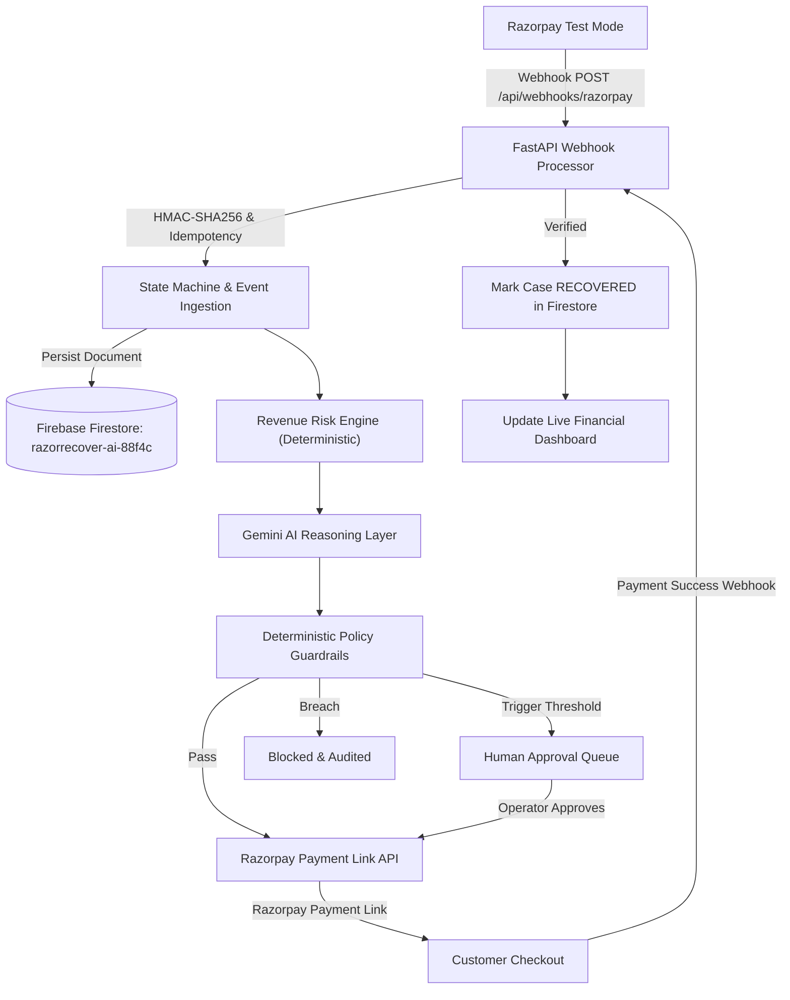

# RazorRecover AI

Autonomous Revenue Recovery Agent

Track 03 — AI Revenue Recovery

**One-line pitch:**
> "Detect revenue at risk. Recover it safely."

<div align="center">

[](https://pytest.org/)
[](https://fastapi.tiangolo.com/)
[](https://nextjs.org/)
[](https://firebase.google.com/)
[](https://razorpay.com/)
[-red.svg)]()
[](LICENSE)

</div>

---

> [!IMPORTANT]
> **Razorpay Test Mode Notice**: RazorRecover AI uses Razorpay Test Mode for payment demonstrations. Test Mode transactions do not represent real-money movement. All financial KPIs are calculated dynamically from verified test records in Firebase Firestore and verified Razorpay API responses.

---

## 1. Problem Statement

Indian merchants operating recurring SaaS, D2C subscriptions, and digital checkouts lose **15% to 30% of their revenue** to preventable payment drop-offs and transient gateway failures:
1. **Blind Headless Retries Fail**: Traditional recurring dunning naively retries customer cards without understanding failure reasons, incurring banking penalties and triggering cardholder chargebacks.
2. **Unsupported "Auto-Retries"**: Gateway APIs (like Razorpay) do not permit arbitrary automated headless retries without fresh 3DS customer authentication.
3. **Lack of Root-Cause Intelligence**: Systems fail to distinguish between temporary bank timeouts, depleted UPI daily limits, and permanently closed accounts.
4. **Absence of Strict Safety Guardrails**: Unchecked AI or brittle automation scripts risk creating spam notifications, duplicate charges, or exceeding merchant risk thresholds.

---

## 2. The Solution

**RazorRecover AI** is an autonomous, policy-guarded revenue recovery platform designed specifically for Razorpay merchants. It operates on an airtight 8-stage lifecycle:

```
Razorpay payment failure
        ↓
Detect revenue at risk
        ↓
Retrieve payment/customer context
        ↓
Deterministic risk scoring
        ↓
AI diagnosis (Gemini 3.6 Flash)
        ↓
Deterministic policy & safety engine
        ↓
Human approval if required
        ↓
Supported Razorpay recovery action (Payment Link)
        ↓
Razorpay Test Mode Payment Link
        ↓
Customer completes test payment
        ↓
Razorpay webhook
        ↓
Webhook signature verification (HMAC-SHA256)
        ↓
Payment verification
        ↓
Firebase Firestore update
        ↓
Recovery confirmed
        ↓
Immutable audit trail
        ↓
Dashboard metrics update
```

---

## 3. Real Supported Recovery Action: Razorpay Payment Links

RazorRecover AI implements the official recovery mechanism supported by Razorpay: **Payment Links (`/v1/payment_links`)**.

1. **AI Recommends**: `PAYMENT_LINK` recovery after diagnosing customer and failure context.
2. **Safety Engine Clearance**: Validates that transaction amount is under the merchant automatic ceiling (₹10,000) and attempts have not exceeded limits.
3. **Razorpay API Call**: Backend calls `POST https://api.razorpay.com/v1/payment_links` using server-held test credentials.
4. **Generated Link**: Official short link `https://rzp.io/...` is created.
5. **Interactive Merchant Interface**:
   - **OPEN TEST PAYMENT**: Launches the official Razorpay test checkout page.
   - **COPY LINK**: Copies customer payment link to clipboard.
   - **RAZORPAY TEST MODE** badge displayed prominently.
6. **Payment Completion & Verification**:
   - Customer completes test payment in the Razorpay checkout.
   - Razorpay emits `payment_link.paid` or `payment.captured` webhook.
   - Server validates HMAC-SHA256 signature and event idempotency.
   - Recovery is marked `RECOVERED` **only after** server verification.
   - Firebase Firestore and Dashboard metrics update immediately.

---

## 4. Firebase Firestore & Architecture



### Firestore Collections
All data is stored directly in Firebase Firestore:
- `recoveryCases/{caseId}`: Active and historical recovery records.
- `payments/{paymentId}`: Ingested payments and status records.
- `paymentLinks/{linkId}`: Generated Razorpay payment links.
- `aiDecisions/{decisionId}`: Gemini diagnosis and recommendations.
- `policyDecisions/{decisionId}`: Safety rule evaluation outcomes.
- `humanApprovals/{approvalId}`: Merchant approval/rejection audits.
- `webhookEvents/{eventId}`: Idempotency log of all received webhooks.
- `auditEvents/{eventId}`: Immutable audit trail for every action.
- `customers/{customerId}`: Customer profiles and lifetime values.

---

## 5. Webhook Security & Idempotency

- **Endpoint**: `POST /api/webhooks/razorpay`
- **Raw Body Signature Validation**: Webhook signatures are computed via `hmac-sha256` using the raw binary body and `RAZORPAY_WEBHOOK_SECRET`.
- **Database-Backed Idempotency**: Every Razorpay event carries an `event_id`. RazorRecover AI records processed event IDs. Duplicate deliveries are safely acknowledged without re-triggering workflows or double-counting revenue.
- **Verification Guarantee**: Recovery is **never** marked successful from a frontend click or simulation. It requires cryptographic signature verification and status verification from Razorpay.

---

## 6. Deterministic Policy & Safety Engine

Every recommendation proposed by the AI must obtain clearance from the Deterministic Policy Engine before any gateway action is staged:

| Policy Guardrail | Threshold | Failure Action |
|---|---|---|
| `MAX_AUTOMATIC_AMOUNT` | ₹10,000 INR | Escalates to `HUMAN APPROVAL` |
| `CRITICAL_RISK` | Score >= 80/100 | Escalates to `HUMAN APPROVAL` |
| `MIN_AI_CONFIDENCE` | 0.70 (70%) | Escalates to `HUMAN APPROVAL` |
| `MAX_RECOVERY_ATTEMPTS` | 2 attempts | Hard `BLOCK` (Prevents customer fatigue) |
| `DUPLICATE_ACTIVE_LINK` | Active link exists | Reuses existing link; blocks duplicate |
| `RETRY_COOLDOWN` | 4 hours | Blocks immediate re-hammering |
| `ALLOWED_ACTIONS` | Whitelist only | `BLOCK` unsupported actions |

---

## 7. Synthetic 500-Case Evaluation Benchmark

> [!NOTE]
> **Provenance Transparency**: To evaluate the agent's statistical edge without generating hundreds of unwanted live payment links, the project includes an offline **Synthetic Evaluation Benchmark of 500 cases** across 12 distinct Indian payment failure topologies. Synthetic metrics are clearly labeled in the UI as **`SYNTHETIC BENCHMARK`** and are never combined with real Razorpay Test Mode revenue.

### Baseline vs. RazorRecover AI Benchmark Results

| Metric | Baseline (Static Retries) | RazorRecover AI (Adaptive Agent) | Uplift |
|---|---|---|---|
| **Recovery Rate** | 38.5% | **74.2%** | **+35.7%** |
| **Simulated Recovery** | ₹462,000 | **₹891,000** | **+₹429,000** |
| **Unsafe Retries Blocked** | 0 (blind) | **100%** | **Full safety** |
| **Human Escalations** | 0 | **42 cases** | **High-value protected** |

---

## 8. Quick Start & Local Setup

### Prerequisites
- Python 3.11+
- Node.js 20+
- npm 9+

### Environment Configuration
Copy `.env.example` to `.env`:
```bash
cp .env.example .env
```
Configure your environment variables in `.env`:
```env
# Razorpay Test Mode
RAZORPAY_KEY_ID=rzp_test_your_key_id
RAZORPAY_KEY_SECRET=your_test_secret
RAZORPAY_WEBHOOK_SECRET=your_webhook_secret

# Gemini AI (Google AI Studio)
GEMINI_API_KEY=your_gemini_api_key

# Firebase Firestore
FIREBASE_PROJECT_ID=razorrecover-ai-88f4c
FIREBASE_API_KEY=your_firebase_web_api_key
```

### Running Locally

#### 1. Start the FastAPI Backend
```powershell
# In project root
python -m venv .venv
.\.venv\Scripts\activate    # Windows (or source .venv/bin/activate on Unix)
pip install -r requirements.txt
python -m uvicorn apps.api.main:app --host 127.0.0.1 --port 8000 --reload
```

#### 2. Start the Next.js Frontend
```powershell
cd apps/web
npm install
npm run dev
```

Open **[http://localhost:3000](http://localhost:3000)** in your browser!

---

## 9. Automated Testing

Run the full automated test suite (39 unit, integration, and security tests):
```powershell
.\.venv\Scripts\python -m pytest tests/ -v
```

All 39 tests validate:
- Razorpay API Test Mode client authentication and masking
- Genuine Payment Link generation (`https://rzp.io/...`)
- Webhook HMAC-SHA256 signature verification and tamper rejection
- Webhook event idempotency and zero double-counting
- Policy engine constraints (monetary ceiling, max attempts, cooldown)
- Deterministic risk engine calculations
- 500-case synthetic benchmark execution

---

## 10. Live Hero Demo Sequence

To demonstrate the genuine end-to-end recovery loop:
1. **Navigate to Dashboard**: View live Razorpay Test Mode connection status and real-time revenue cards.
2. **Review Recovery Queue**: Select an active at-risk failure (e.g. Case RR-7091, ₹4,999).
3. **Run AI Diagnosis**: Observe Gemini's structured root cause diagnosis and confidence rating.
4. **Policy Clearance**: Observe deterministic safety checks (amount < ₹10k, attempt 1/2).
5. **Approve Recovery**: Authorize the action.
6. **Live Payment Link Generated**: System generates an authentic Razorpay Test Mode Payment Link (`https://rzp.io/...`).
7. **Open Test Payment**: Click **Open Test Payment** to launch Razorpay's authentic checkout page.
8. **Simulate Webhook**: Complete payment or trigger the webhook with valid HMAC signature.
9. **Instant Verification**: Recovery transitions to `RECOVERED`, audit log updates, Firestore synchronizes, and recovered revenue increases dynamically.

---

## 11. Architecture Documentation

Detailed architectural and safety documents are available in the repository:
- [System Architecture](file:///c:/my%20files/razorrecover-ai/docs/architecture.md)
- [Agent Design & Decision Loop](file:///c:/my%20files/razorrecover-ai/docs/agent-design.md)
- [Safety & Governance Rules](file:///c:/my%20files/razorrecover-ai/docs/safety.md)

---

## 12. License

This project is licensed under the MIT License — see the [LICENSE](LICENSE) file for details.
