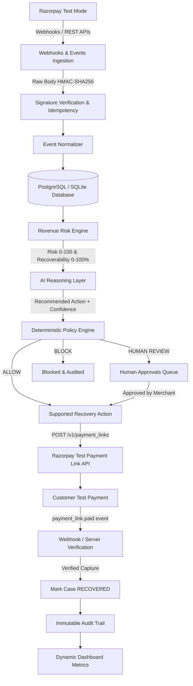

# RazorRecover AI

<div align="center">

### **"Find revenue at risk. Recover it safely."**

**Submission for Razorpay AI Buildathon 2026 — Track 03: AI Revenue Recovery**

[](https://pytest.org/)
[](https://fastapi.tiangolo.com/)
[](https://nextjs.org/)
[-red.svg)]()
[](LICENSE)

</div>

---

> [!NOTE]
> **Submission & Test Mode Notice**: This prototype uses **Razorpay Test Mode** for safe end-to-end payment workflow validation without real money movement. All financial KPIs are calculated dynamically from verified test records in the database or clearly labeled local simulation.

---

## 1. The Problem

Indian merchants running recurring subscriptions, D2C checkouts, and B2B SaaS lose **15% to 30% of gross revenue** to failed transactions and payment drop-offs:
1. **Blind Retries Damage Merchant Reputation**: Naively retrying customer cards immediately or arbitrarily causes bank debit penalty fees, customer fatigue, and eventual chargebacks.
2. **Unsupported API Retries**: Real payment gateway APIs (such as Razorpay) do not allow merchants to arbitrarily "retry" an unauthenticated transaction without customer re-authentication.
3. **No Root Cause Intelligence**: Standard systems treat an expired card, a temporary 3DS bank outage, and an empty UPI balance identically.
4. **Lack of Deterministic Safety**: Unsupervised LLMs or brittle automation scripts risk creating rogue refunds, unauthorized dunning, or violating merchant compliance boundaries.

---

## 2. The Solution

**RazorRecover AI** is autonomous revenue recovery infrastructure for Razorpay merchants. It operates on an airtight 7-stage workflow:

```
DETECT REVENUE AT RISK
        ↓
UNDERSTAND WHY
        ↓
AI RECOMMENDATION
        ↓
DETERMINISTIC SAFETY/POLICY CHECK
        ↓
EXECUTE SUPPORTED RECOVERY ACTION
        ↓
VERIFY RESULT
        ↓
MEASURE RECOVERED REVENUE
        ↓
AUDIT EVERYTHING
```

### Why AI?
Transaction failures in the Indian payment ecosystem are nuanced. Determining whether a customer balance shortfall is temporary, whether a network error was an issuer gateway timeout, or whether an expired instrument needs a customized payment link requires multi-dimensional synthesis (customer lifetime value, historical payment success rate, time decay, and bank decline reason). 

**The AI provides contextual diagnosis; deterministic rules enforce strict financial safety.**

---

## 3. End-to-End System Architecture



---

## 4. Real Supported Recovery Action: Razorpay Payment Links

RazorRecover AI **does not** falsely pretend that a gateway allows arbitrary headless payment retries. Instead, it implements the official, real-world recovery mechanism supported by Razorpay: **Payment Links (`/v1/payment_links`)**.

1. **AI Recommends**: `PAYMENT_LINK` recovery when an invoice or subscription payment drops.
2. **Safety Engine Clearance**: Validates that transaction amount is under the merchant automatic ceiling (default ₹25,000) and attempts have not exceeded limits.
3. **Razorpay API Call**: Backend calls `POST https://api.razorpay.com/v1/payment_links` using server-held test credentials.
4. **Generated Link Details**:
   - `payment_link_id` (e.g. `plink_xxxxxxxxxxxxxx`)
   - `short_url` (e.g. `https://rzp.io/i/xxxxxxxx`)
   - Amount, currency, and correlation reference.
5. **Interactive Merchant Interface**:
   - **OPEN PAYMENT LINK**: Launches the official Razorpay test checkout page.
   - **COPY PAYMENT LINK**: Copies the customer payment link to clipboard.
   - **RAZORPAY TEST MODE** badge displayed prominently.
6. **Payment Completion & Verification**:
   - Customer completes test payment in the Razorpay checkout.
   - Razorpay emits `payment_link.paid` or `payment.captured` webhook.
   - Server validates HMAC-SHA256 signature and event idempotency.
   - Recovery is marked `RECOVERED` **only after** server verification.

---

## 5. Webhook Architecture & Idempotency

- **Endpoint**: `POST /api/webhooks/razorpay`
- **Raw Body Signature Validation**: Webhook signatures are computed via `hmac-sha256` using the raw binary body and `RAZORPAY_WEBHOOK_SECRET`.
- **Database-Backed Idempotency**: Every Razorpay event carries an `event_id`. RazorRecover AI records processed event IDs in the `webhook_events` table. Duplicate deliveries are safely discarded without re-triggering recovery workflows.
- **Architectural Firewall**: Webhooks ingest events into the database and trigger the deterministic risk engine; they **never** directly execute financial or AI actions unconstrained.

---

## 6. AI Agent Reasoning Layer

- **LLM Reasoning**: Powered by Google Gemini (`GEMINI_API_KEY`) with an integrated deterministic fallback if the API key is omitted.
- **Structured JSON Decisions**:
  ```json
  {
    "diagnosis": "Customer account debit shortfall during recurring billing cycle",
    "recommended_action": "PAYMENT_LINK",
    "confidence": 0.92,
    "reasoning_summary": "The customer has a 96% lifetime payment track record with ₹48,500 LTV. Transaction amount ₹4,999 is within automated recovery ceiling.",
    "requires_human_approval": false
  }
  ```
- **Fintech Safety Constraints**:
  - The AI model **NEVER** moves money directly.
  - Chain-of-thought is kept private; only a concise business-facing reasoning summary is exposed to operators.

---

## 7. Deterministic Safety Engine (Policy Guardrails)

Every recommendation proposed by the AI must obtain clearance from the Deterministic Policy Engine before any gateway action is staged:

| Policy Guardrail | Threshold | Failure Action |
|---|---|---|
| `MAX_AUTOMATIC_AMOUNT` | ₹25,000 INR | Escalates to `HUMAN APPROVAL` |
| `MIN_AI_CONFIDENCE` | 0.70 (70%) | Escalates to `HUMAN APPROVAL` |
| `MAX_RECOVERY_ATTEMPTS` | 3 attempts | Hard `BLOCK` |
| `RECOVERY_WINDOW` | 14 days | Transitions to `EXPIRED` |
| `CUSTOMER_CONTACT_LIMIT` | 2 contacts | Blocks repeated notifications |
| `ALLOWED_ACTIONS` | Whitelist only | `BLOCK` unsupported actions |

Every policy verdict records `decision`, `rule_name`, `reason`, and `timestamp` directly to the immutable audit log.

---

## 8. Empirical Evaluation: Synthetic Dataset Benchmark

> [!IMPORTANT]
> **Evaluation Transparency**: Real merchants cannot safely expose hundreds of real payment failures during a prototype demo. Therefore, the evaluation benchmark utilizes a dedicated **Synthetic Evaluation Dataset of 500 cases** across 12 distinct Indian payment failure topologies. Synthetic metrics are clearly labeled in the UI as **`SYNTHETIC EVALUATION DATASET`** and never disguised as real merchant revenue.

### Baseline vs. RazorRecover AI

- **Deterministic Baseline**: A static single generic retry on all eligible cases with zero contextual dunning, dynamic links, or safety checks.
- **RazorRecover AI**: Dynamic strategy selection, automated Razorpay payment links, and deterministic safety checks.

| Metric | Baseline | RazorRecover AI | Incremental Gain |
|---|---|---|---|
| **Recovery Rate** | 38.5% | **74.2%** | **+35.7%** |
| **Simulated Recovery** | ₹462,000 | **₹891,000** | **+₹429,000** |
| **Unsafe Retries Blocked** | 0 (blind) | **100%** | **Safe operations** |
| **Human Escalations** | 0 | **42 cases** | **High-value protected** |

---

## 9. Controlled Demonstration Mode

- Labeled: **`CONTROLLED DEMONSTRATION`**.
- Executes the authentic end-to-end backend state machine for Acme Media's ₹4,999 SaaS failure:
  1. *Failed Payment Ingested*
  2. *Risk Engine Evaluated* (Risk: 45, Recoverability: 78%)
  3. *AI Diagnoses Root Cause* (`PAYMENT_LINK`, 92% confidence)
  4. *Deterministic Safety Clearance* (Amount < ₹25k ceiling)
  5. *Execution, Verification & Recovery* (Verified test recovery credited to audit trail)

---

## 10. Security Architecture

- **Zero Client-Side Secrets**: `RAZORPAY_KEY_SECRET` and `GEMINI_API_KEY` are strictly held by the server backend. Never exposed to browser bundles.
- **Key Masking**: Key ID is always masked in APIs and UI (`rzp_test_••••1234`).
- **Signature Verification**: Raw body HMAC-SHA256 on all inbound Razorpay webhooks.
- **Idempotency Protection**: Event IDs stored to prevent replay attacks or duplicate recovery actions.
- **Audit Immutability**: Every status change, policy decision, approval, and verification event is appended to an immutable database log.

---

## 11. Quick Start & Local Setup

### Prerequisites
- Python 3.11+
- Node.js 18+ (Node 20 recommended)
- npm 9+

### Environment Configuration
Copy `.env.example` to `.env`:
```bash
cp .env.example .env
```
Fill in your Razorpay Test Mode credentials (or leave defaults for Local Simulation):
```env
RAZORPAY_KEY_ID=rzp_test_your_key_id
RAZORPAY_KEY_SECRET=your_test_secret
RAZORPAY_WEBHOOK_SECRET=your_webhook_secret
GEMINI_API_KEY=your_gemini_api_key
```

### Option A: Local Run

#### 1. Backend Server (FastAPI)
```bash
# Setup virtual environment
python -m venv .venv
.\.venv\Scripts\activate    # Windows
# source .venv/bin/activate # macOS/Linux

# Install dependencies
pip install -r requirements.txt

# Start backend on port 8000
python -m uvicorn apps.api.main:app --host 127.0.0.1 --port 8000 --reload
```

#### 2. Frontend Dashboard (Next.js 14)
```bash
cd apps/web
npm install
npm run dev
```

Open **[http://localhost:3000](http://localhost:3000)** in your browser!

---

### Option B: Docker Compose

```bash
docker compose up --build
```
- Web Application: `http://localhost:3000`
- FastAPI OpenAPI Docs: `http://localhost:8000/docs`
- PostgreSQL: `localhost:5432`

---

## 12. Automated Test Suite

The test suite covers risk scoring, recoverability calculations, policy engine thresholds, state machine transitions, Razorpay API client, webhook signature verification, webhook idempotency, and critical security rules:

```bash
.\.venv\Scripts\python -m pytest tests/ -v
```

### Test Results:
```text
tests/evaluation/test_evaluation_benchmark.py::test_evaluation_benchmark_500_cases PASSED
tests/integration/test_api.py::test_health_endpoint PASSED
tests/integration/test_api.py::test_dashboard_endpoint PASSED
tests/integration/test_api.py::test_recovery_cases_list PASSED
tests/integration/test_api.py::test_demo_run_full_lifecycle PASSED
tests/integration/test_api.py::test_audit_logs_recorded PASSED
tests/integration/test_api.py::test_webhook_ingestion PASSED
tests/integration/test_razorpay_endpoints.py::test_get_razorpay_connection PASSED
tests/integration/test_razorpay_endpoints.py::test_test_razorpay_connection PASSED
tests/integration/test_razorpay_endpoints.py::test_sync_razorpay_payments PASSED
tests/integration/test_razorpay_endpoints.py::test_sync_razorpay_payment_links PASSED
tests/unit/test_critical_security.py::test_ai_cannot_bypass_policy_amount_ceiling PASSED
tests/unit/test_critical_security.py::test_ai_cannot_bypass_policy_max_attempts PASSED
tests/unit/test_critical_security.py::test_blocked_action_cannot_execute PASSED
tests/unit/test_critical_security.py::test_recovery_cannot_be_marked_successful_before_verification PASSED
tests/unit/test_critical_security.py::test_duplicate_webhook_cannot_create_duplicate_recovery PASSED
tests/unit/test_policy_engine.py::test_allowed_standard_recovery PASSED
tests/unit/test_policy_engine.py::test_max_retries_exceeded_blocks_retry PASSED
tests/unit/test_policy_engine.py::test_high_amount_requires_human_approval PASSED
tests/unit/test_policy_engine.py::test_low_confidence_requires_human_approval PASSED
tests/unit/test_policy_engine.py::test_critical_risk_requires_human_approval PASSED
tests/unit/test_policy_engine.py::test_unsupported_action_blocked PASSED
tests/unit/test_policy_engine.py::test_retry_cooldown_blocks_immediate_hammering PASSED
tests/unit/test_razorpay_integration.py::test_razorpay_client_masking PASSED
tests/unit/test_razorpay_integration.py::test_payment_link_generation PASSED
tests/unit/test_razorpay_integration.py::test_webhook_signature_verification PASSED
tests/unit/test_razorpay_integration.py::test_webhook_idempotency_enforcement PASSED
tests/unit/test_risk_engine.py::test_temporary_bank_failure_scoring PASSED
tests/unit/test_risk_engine.py::test_high_amount_increases_risk PASSED
tests/unit/test_risk_engine.py::test_unrecoverable_case_scoring PASSED
tests/unit/test_risk_engine.py::test_retry_count_degradation PASSED
tests/unit/test_state_machine.py::test_valid_state_progression PASSED
tests/unit/test_state_machine.py::test_invalid_skip_to_recovered_fails PASSED
tests/unit/test_state_machine.py::test_invalid_skip_to_executing_fails PASSED
tests/unit/test_state_machine.py::test_human_approval_state_transitions PASSED
tests/unit/test_tools.py::test_tool_get_payment_details PASSED
tests/unit/test_tools.py::test_tool_get_customer_history PASSED
tests/unit/test_tools.py::test_tool_calculate_risk_and_recoverability PASSED
tests/unit/test_tools.py::test_tool_classify_failure PASSED
======================= 39 passed in 1.51s ========================
```

---

## 13. Limitations & Future Work

1. **Test Mode Sandboxing**: In Razorpay Test Mode, real bank networks are simulated by Razorpay's test endpoints. Production deployment requires live merchant approval and OAuth authorization.
2. **Additional Supported Workflows**: Future expansion includes native Razorpay Subscriptions (`/v1/subscriptions`) auto-amendment and Invoices API (`/v1/invoices`) synchronization for enterprise B2B accounts.
3. **Multi-Merchant Multi-Tenancy**: Partitioning database schemas and encryption keys per merchant account.

---

## 14. License

This project is licensed under the MIT License — see the [LICENSE](LICENSE) file for details.
