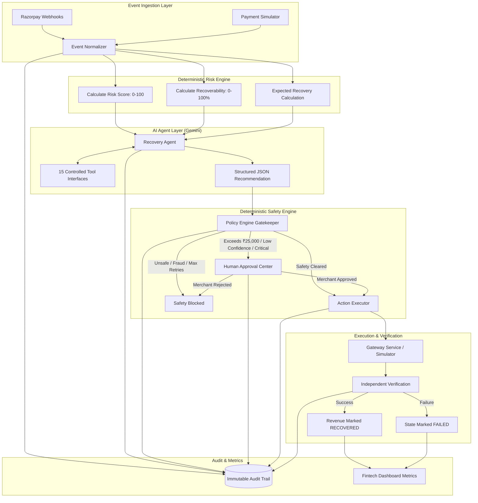

# System Architecture — RazorRecover AI

**Tagline**: *"Find revenue at risk. Recover it safely."*  
**Track**: Razorpay AI Buildathon 2026 — Track 03: AI Revenue Recovery

---

## 1. High-Level Architecture Overview

RazorRecover AI is designed as a mission-critical financial system where money movement is protected by deterministic guardrails, and generative AI is leveraged strictly for diagnostic reasoning, contextual pattern analysis, and recovery strategy recommendation.

---

## 2. Component Responsibilities

| Component | Responsibility | Tech Stack |
|---|---|---|
| **Event Normalizer** | Ingests `payment.failed`, `order.paid`, `invoice.overdue` from Razorpay webhooks and simulator. Verifies HMAC-SHA256 signatures. | FastAPI, Python |
| **Revenue Risk Engine** | Mathematically computes risk scores (0–100) and recovery probabilities based on amount, tenure, LTV, retry decay, and failure taxonomy. | Pure Python, Deterministic |
| **AI Agent** | Leverages Gemini 2.5 Flash with tool calling to diagnose root cause and recommend tailored recovery action (e.g., `DELAYED_RETRY`, `PAYMENT_LINK`). | Google GenAI SDK |
| **Policy Engine** | Hard deterministic guardrails enforcing retry limits, amount ceilings, cooldown intervals, and contact spam thresholds. | Deterministic Rule Engine |
| **Human Approval Center** | Merchant interface holding high-value or low-confidence actions for manual sign-off. | React / Next.js |
| **Gateway Service** | Dual-mode layer interacting with live Razorpay Test Mode or local high-fidelity Simulator. | Razorpay SDK, HTTPX |
| **Verification Engine** | Independently confirms payment capture before declaring capital recovered. | SQLAlchemy, FastAPI |
| **Audit Trail** | Correlation-tracked ledger recording every actor, decision reason, state transition, and payload. | PostgreSQL / SQLite |
